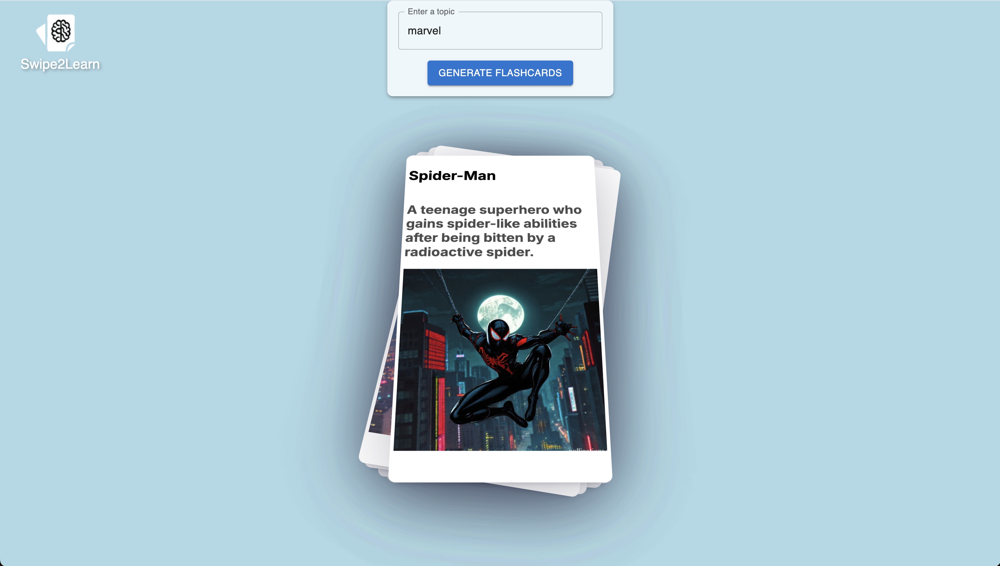

# Swipe2Learn

_Tired of scrolling? Start swiping 🃏_

## Overview

The project uses the following stack:

- Next.js
- JavaScript
- [Material UI](https://mui.com/material-ui/)
- [React Spring](https://www.react-spring.dev/)
- [Gemini API](https://ai.google.dev/gemini-api/docs/quickstart?lang=node)
- [Pollinations](https://image.pollinations.ai/prompt/)

